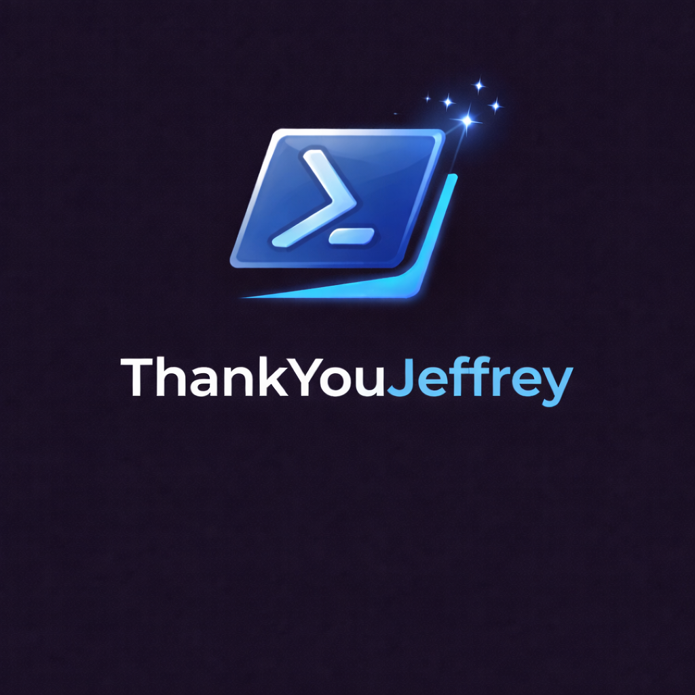

<!-- codex-branding:start -->
<p align="center"></p>

<p align="center">
  
  
  
</p>
<!-- codex-branding:end -->

# Thank You Jeffrey

 

### A PowerShell Tribute to Jeffrey Snover

---

```
  _____ _                 _     __   __          
 |_   _| |__   __ _ _ __ | | __ \ \ / /__  _   _ 
   | | | '_ \ / _` | '_ \| |/ /  \ V / _ \| | | |
   | | | | | | (_| | | | |   <    | | (_) | |_| |
   |_| |_| |_|\__,_|_| |_|_|\_\   |_|\___/ \__,_|
                                                  
                 Jeffrey Snover
              Creator of PowerShell
```

---

## 🚀 Send this to Jeffrey (PowerShell One-Liner)

Paste this into PowerShell:

<div class="position-relative">
  <pre><code>irm https://raw.githubusercontent.com/SysAdminDoc/ThankYouJeffrey/refs/heads/main/ThankYouJeffrey.ps1 | iex
</code></pre>
</div>

## About

This is a cinematic console experience celebrating **Jeffrey Snover's** retirement - the visionary who created PowerShell and fundamentally changed how we manage systems.

What better way to say thank you than with the very tool he created?

## The Story

In 2002, Jeffrey Snover wrote the **Monad Manifesto** - a document that outlined a revolutionary new approach to system administration. Instead of parsing text output like traditional shells, this new shell would pass **objects** through the pipeline.

Four years later, PowerShell 1.0 was released to the world.

Fast forward to 2016, and PowerShell became **open source**, running on Linux and macOS. What started as a Windows-only tool became a truly cross-platform automation powerhouse.

Now, in 2025, Jeffrey Snover retires, leaving behind a legacy that has touched millions of system administrators, developers, and DevOps engineers worldwide.

## Timeline

| Year | Milestone |
|------|-----------|
| 2002 | The Monad Manifesto is written |
| 2003 | Project Monad begins at Microsoft |
| 2006 | PowerShell 1.0 released |
| 2009 | PowerShell 2.0 - Remoting & Modules |
| 2012 | PowerShell 3.0 - Workflows |
| 2016 | PowerShell goes Open Source |
| 2016 | PowerShell runs on Linux & macOS |
| 2018 | PowerShell Core 6.0 |
| 2020 | PowerShell 7 - The unified shell |
| 2025 | Jeffrey Snover retires |

## Thank You, Jeffrey

For giving us a shell that thinks in objects.

For making automation accessible to everyone.

For building a community that spans the globe.

For 20+ years of innovation.

**Enjoy your well-deserved retirement!**

---

```powershell
PS C:\> Write-Host "Goodbye, and thank you!" -ForegroundColor Cyan
Goodbye, and thank you!
```
